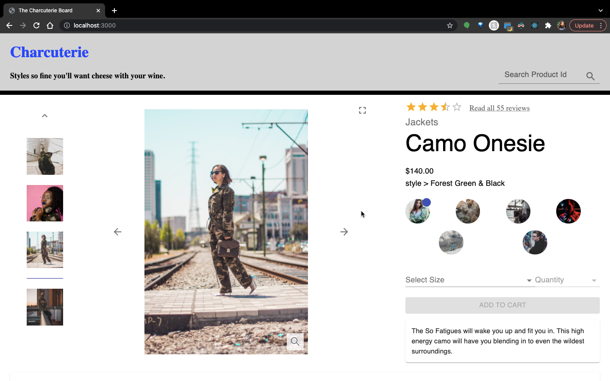
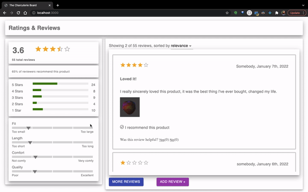

# Charcuterie
  <br />

<!-- TABLE OF CONTENTS -->
<details open="open">
  <summary><h2 style="display: inline-block">Table of Contents</h2></summary>
  <ol>
    <li><a href="#about-the-project">About The Project</a></li>
    <li><a href="#contributors">Contributors</a> </li>
    <ul>
      <li><a href="#william-fink">William Fink</a></li>
      <li><a href="#blake-hughes">Blake Hughes</a></li>
      <li><a href="#pingping-xiao">Pingping Xiao</a></li>
    </ul>
    <li><a href="#tech-stack">Tech Stack</a> </li>
    <li><a href="#getting-started">Getting Started</a>
    <ul>
      <li><a href="#prerequisites">Prerequisites</a></li>
      <li><a href="#installation">Installation</a></li>
    </ul>
    <li><a href="#Application Demo">Application Demo</a> </li>
  </ol>
</details>
<br />

<!-- ABOUT THE PROJECT -->
## About The Project

<br>
<div align="center">

</div><br><br>

 A three person team was tasked to redesigned an outdated client-facing retail website (Catwalk) over the course of a week based on a supplied business requirement document.

 Charcuterie, a front end capstone project comprises the complete redesign and modernization of the site. The intention of this initial release is to first build out a product page with product overview, questions & answers and ratings & reviews modules.

<!-- Screen Shot when finished-->

## Contributors

### William Fink

wwfink30@gmail.com

Product Overview

 

[![linkedin-shield]][william-linkedin]
[![github-shield]][william-github]

<br/>

### Blake Hughes

blake.ed.hughes@gmail.com

Ratings & Reviews

 

[![linkedin-shield]][blake-linkedin]
[![github-shield]][blake-github]

<br/>

### Pingping Xiao

xiaopingping1994@gmail.com

Questions & Answers

 

[![linkedin-shield]][pingping-linkedin]
[![github-shield]][pingping-github]

<br />

## Tech Stack

- [NodeJS](https://nodejs.org/)
- [React](https://reactjs.org/)
- [MaterialUI](https://mui.com/)
- [Axios](https://axios-http.com/)
- [Express](https://expressjs.com/)
- [Webpack](https://webpack.js.org/)
- [Babel](https://babeljs.io/)
- [DateFormat](https://github.com/felixge/node-dateformat)
- [Emotion](https://github.com/emotion-js/emotion)
- [React-Icons](https://github.com/react-icons/react-icons)
- [React-Inner-Image-Zoom](https://github.com/laurenashpole/react-inner-image-zoom)
- [Compression](https://github.com/expressjs/compression)

<br />


<!-- GETTING STARTED -->
## Getting Started

To get a local copy up and running follow these simple steps.

### Prerequisites

* npm
  ```sh
  npm install npm@latest -g
  ```

### Installation

1. Clone the repo
   ```sh
   git clone https://github.com/Team-Asiago/FEC.git
   ```
2. Install NPM packages
   ```sh
   npm install
   ```
3. Duplicate copy config_copy.js to config.js
4. Set API key within config.js
   ```JS
   const API_key = 'Your API key goes here';
   ```
5. Compile and Build Files to be served
   ```sh
   npm run build
   ```
6. Launch server to listen on port 3000
   ```sh
   npm start
   ```
<br />

## Application Demo

> ### Sorting reviews by category

<br>
<div align="center">

</div>
<br><br>

> ### Sorting reviews by rating

<br>
<div align="center">

</div>
<br><br>

> ### Adding a review

<br>
<div align="center">

</div>
<br><br>


<!-- Contributor Links -->

[william-linkedin]: https://www.linkedin.com/in/william-w-fink/
[william-github]: https://github.com/wwfink30
[blake-linkedin]: https://www.linkedin.com/in/blakeedwardhughes/
[blake-github]: https://github.com/blake-ed-hughes
[pingping-linkedin]: https://www.linkedin.com/in/pingpingxiao/
[pingping-github]: https://github.com/Applebear912
[linkedin-shield]: https://img.shields.io/badge/-LinkedIn-grey?style=for-the-badge&logo=linkedin
[github-shield]: https://img.shields.io/badge/-GitHub-grey?style=for-the-badge&logo=github
